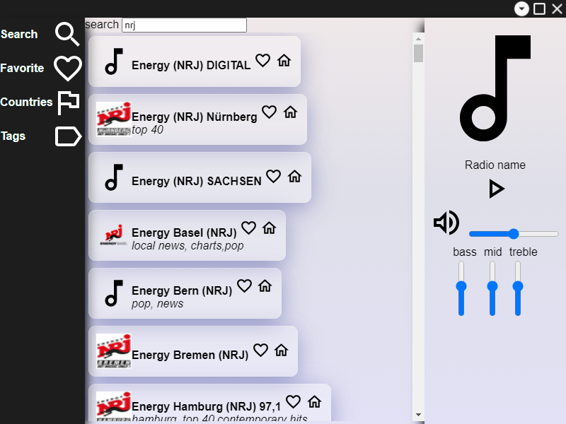
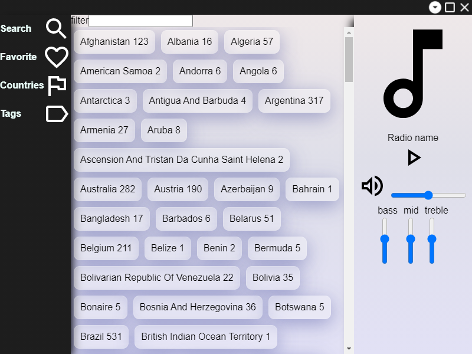

# Rose player

This project is a web radio player based upon Electron Framework.
 
It's my small attempt to revive the now defunct Odio. Of course, it's free, without subscription plan and absolutely open source ! 

This app is based upon [radio-browser api](https://www.npmjs.com/package/radio-browser)

In order to build this app, use the following command:
~~~
npm install --save-dev @electron-forge/cli
npx electron-forge import
~~~

Hope you'll enjoy try it !

